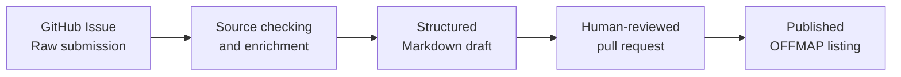

<h1 align="center">OFFMAP</h1>

<p align="center">
  <strong>THE OPPORTUNITIES ARE OUT THERE.<br>THE MAP JUST ISN'T.</strong>
</p>

<p align="center">
  A student-first platform for discovering opportunities beyond the obvious path.
</p>

<p align="center">
  <a href="#explore-offmap"><strong>Explore</strong></a>
  ·
  <a href="#submit-an-opportunity"><strong>Submit an opportunity</strong></a>
  ·
  <a href="#contribute"><strong>Contribute</strong></a>
</p>

<p align="center">
  
  
  
  
</p>

---

## What is OFFMAP?

**OFFMAP helps students find opportunities that are easy to miss, difficult to understand, scattered across the internet, or shared only inside the right circles.**

Scholarships. Research programs. Internships. Fellowships. Hackathons. Competitions. Volunteering projects. Courses. Conferences. Creative calls. Summer schools. International programs. Side quests that may change what you study, build, or become.

The purpose is simple:

> Make worthwhile opportunities easier to discover, understand, compare, and act on.

OFFMAP is currently being built as an open, structured opportunity repository. The long-term vision is a wider platform where students can also access practical application resources, learn from creators and past participants, build profiles, follow opportunity paths, and connect with people who applied to or attended the same programs.

---

## Why OFFMAP exists

Many valuable opportunities are not truly inaccessible. They are simply buried.

They live on outdated websites, institutional pages, scattered social-media posts, newsletters, PDFs, private networks, or application portals apparently designed during a prolonged disagreement with usability.

Students should not need:

- the perfect algorithm;
- the right university mailing list;
- an already impressive network;
- hours of searching;
- or suspicious amounts of luck

to find programs that fit them.

OFFMAP is built to make discovery more open, practical, and fair.

---

## Explore OFFMAP

OFFMAP organises opportunities by the path they can open.

| Path | What you can find |
|---|---|
| 💼 **Internships & Jobs** | Internships, traineeships, placements, graduate roles, and early-career positions |
| 🎓 **Scholarships & Funding** | Scholarships, grants, travel support, fee waivers, and funded study |
| 🔬 **Research & Fellowships** | Research programs, laboratories, fellowships, academies, and scientific exchanges |
| 🤝 **Volunteering & Impact** | NGO work, humanitarian programs, environmental projects, and community initiatives |
| 🏆 **Competitions & Challenges** | Hackathons, engineering competitions, case challenges, olympiads, and innovation contests |
| 🎨 **Creative & Media** | Open calls, design, writing, journalism, film, exhibitions, and creator programs |
| 🌍 **International Experiences** | Exchanges, conferences, summer schools, camps, seminars, and global programs |
| 🧭 **Side Quests** | Skill challenges, unusual projects, short programs, and opportunities that do not fit neatly into one box |

Browse the published entries in the [`opportunities/`](opportunities/) directory.

---

## What makes an OFFMAP listing useful?

Every published opportunity should help a student answer the questions that actually matter:

- What is it?
- Who is organising it?
- Who can apply?
- Where does it take place?
- Is it online, in person, or hybrid?
- Is it funded?
- What does the funding cover?
- When is the deadline?
- Where is the official information?
- Where is the direct application link?
- Is anything unclear or unverified?

OFFMAP is not meant to become a decorative pile of links. Listings are structured so they can later support:

- search and filtering;
- deadline tracking;
- automatic archiving;
- category and location indexes;
- statistics;
- personalised recommendations;
- application planning;
- website and app interfaces.

---

## How an opportunity is published

OFFMAP uses a review-first submission pipeline.

### 1. Raw submission

A contributor submits an opportunity through a GitHub Issue Form.

The original issue remains the **raw record** of what the contributor entered. It is not silently rewritten or replaced.

### 2. Source-backed enrichment

Automation may check the submitted official website, direct application page, and other reliable sources.

It may:

- fill clearly supported missing information;
- normalise dates, categories, locations, and formats;
- flag conflicting information;
- attach evidence and provenance;
- identify details that need moderator review.

It must not present guesses as facts.

### 3. Publishable draft

A second, polished version is generated as a structured Markdown opportunity page with YAML front matter.

The final page should be readable, colourful, clear, and consistent without changing the underlying facts.

### 4. Human review

The proposed page is placed in a pull request.

A moderator reviews:

- the official source;
- the direct application link;
- eligibility;
- deadline;
- location and format;
- funding;
- duplicate listings;
- unsupported claims;
- safety and relevance.

### 5. Publication

Only reviewed entries are merged into the main collection.



---

## Trust before hype

OFFMAP should be useful because students can trust it, not because every post promises to transform their life before Tuesday.

### Publishing principles

- Prefer official and primary sources.
- Keep the original submission available.
- Preserve evidence for enriched information.
- Mark uncertainty clearly.
- Never invent missing dates, funding, eligibility, or application details.
- Do not publish automatically without human review.
- Correct expired or inaccurate listings.
- Make essential information readable and easy to find.
- Separate confirmed facts from recommendations or interpretation.

### Important disclaimer

OFFMAP helps users discover and understand opportunities, but it does not organise, sponsor, guarantee, or formally endorse every listed program.

Applicants must always confirm the final details on the official website before applying, travelling, paying fees, submitting personal data, or making decisions based on a listing.

---

## Submit an opportunity

Found something worth sharing?

Open the **Submit an Opportunity** Issue Form and provide as much verified information as possible.

A strong submission includes:

- the official opportunity name;
- category;
- organiser;
- short description;
- official or otherwise reliable source;
- direct application link;
- deadline;
- format and location;
- eligibility;
- academic or career fields;
- funding or support;
- any important restrictions.

Missing optional information is acceptable. Invented information is not. The internet already has enough confident nonsense without our assistance.

You can find the form inside:

```text
.github/ISSUE_TEMPLATE/submit-opportunity.yml
```

---

## Structured opportunity format

Each published opportunity is stored as Markdown with YAML front matter.

A simplified entry may look like this:

```yaml
---
title: "Example Research Fellowship"
slug: "example-research-fellowship"

category:
  - research
  - fellowship

organizer: "Example Institute"

application_deadline: "2027-02-15"

format: "in-person"

location:
  country: "Germany"

eligibility:
  academic_level:
    - undergraduate

funding:
  status: "partially-funded"

official_url: "https://example.org/program"
application_url: "https://example.org/apply"

status: "open"
source_checked: true
last_verified: "2026-07-17"
---
```

The schema will evolve as OFFMAP grows, but four rules remain fixed:

1. Preserve the raw submission.
2. Keep sources and evidence attached.
3. Mark uncertainty instead of hiding it.
4. Require review before publication.

---

## Contribute

You do not need to be a developer to help build OFFMAP.

### Ways to contribute

- Submit a new opportunity.
- Correct an existing listing.
- Report an expired deadline.
- Replace a broken link.
- Add a stronger official source.
- Improve accessibility or wording.
- Review submissions.
- Help moderate pull requests.
- Develop validation tools.
- Improve search and filtering.
- Build indexes.
- Design reusable templates.
- Create educational resources.
- Share an authentic participant story.
- Produce short creator videos about applications and experiences.

Read [`CONTRIBUTING.md`](CONTRIBUTING.md) before making a substantial change.

Security-related reports should follow [`SECURITY.md`](SECURITY.md) rather than being posted publicly.

---

## Creator and participant content

OFFMAP is designed to support more than official opportunity descriptions.

Future content may include:

- “How I applied” videos;
- participant diaries;
- application breakdowns;
- scholarship and fellowship explainers;
- realistic cost summaries;
- interview advice;
- portfolio and CV guidance;
- lessons from rejection;
- lessons from acceptance;
- event photography;
- moderated participant galleries.

Official information and community content should remain clearly separated.

Creator content may be helpful, personal, and practical, but it must never be presented as an official rule unless the relevant organiser confirms it.

---

## Community vision

The future OFFMAP platform may help users connect around shared opportunities.

Possible features include:

- opportunity-based discussion spaces;
- groups for applicants, accepted participants, attendees, and alumni;
- shared event galleries;
- optional public profiles;
- skill and interest tags;
- application progress tools;
- participant advice;
- networking links;
- creator posts;
- saved resources and opportunity collections.

Participation must be:

- optional;
- privacy-conscious;
- clearly moderated;
- safe by default;
- transparent about who can see what;
- separated between applicants, accepted participants, and alumni where appropriate.

Users should choose whether to share their profile, application status, contact details, social links, or participation history.

---

## Roadmap

### Now

- Stabilise the GitHub submission workflow.
- Preserve raw submissions.
- Improve source validation.
- Generate structured draft pages.
- Keep publication human-reviewed.
- Build opportunity indexes.
- Develop moderator tools.
- Apply the OFFMAP visual identity consistently.

### Next

- Public searchable website.
- Category, location, eligibility, deadline, and funding filters.
- Automatic archiving of expired listings.
- Save and compare tools.
- Application resources.
- Creator and participant content.
- Better accessibility and mobile layouts.

### Later

- Personalised discovery.
- User profiles.
- Opportunity-based communities.
- Application tracking.
- Participant and alumni networking.
- Shared galleries.
- Recommendations based on interests, eligibility, goals, and experience.

The roadmap is intentionally ambitious. Modesty has never built a useful map, though unchecked feature creep has certainly buried several thousand apps.

---

## Brand direction

OFFMAP is built around a bold, editorial, student-first visual system.

### Visual language

- Warm cream paper backgrounds
- Ink-black typography
- Oversized editorial headlines
- Real student photography
- Collage layers
- Torn paper
- Sticky notes
- Map pins
- Routes and arrows
- Hand-drawn stars and doodles
- Bright, controlled accent colours
- Clear calls to action
- Strong mobile readability

### Core palette

| Colour | Hex |
|---|---:|
| Electric Blue | `#2563EB` |
| Coral Orange | `#FF5A36` |
| Lime Green | `#C6F23C` |
| Hot Pink | `#FF4D8B` |
| Violet Purple | `#8B5CF6` |
| Ink Black | `#111111` |
| Warm Cream | `#F7F2E8` |

### Typography

- **Display:** Bebas Neue
- **Body and interface:** Inter
- **Accent:** handwritten or marker-style type used sparingly

### Tone

OFFMAP should sound:

- curious;
- direct;
- practical;
- bold;
- encouraging;
- transparent;
- human;
- student-first.

No corporate fog. No fake urgency. No treating students like lead-generation livestock.

---

## Repository structure

```text
.
├── .github/
│   ├── ISSUE_TEMPLATE/       # Opportunity submission forms
│   └── workflows/            # Validation and draft-generation workflows
│
├── opportunities/            # Published opportunity pages
├── scripts/                  # Generation, validation, and indexing tools
├── assets/                   # Brand and repository assets
│
├── CONTRIBUTING.md
├── SECURITY.md
├── LICENSE
└── README.md
```

The structure may evolve, but the source-backed and review-first publishing model should remain stable.

---

## Project status

OFFMAP is currently an early-stage project being built in public.

That means:

- the schema may change;
- workflows may be refined;
- the visual system is still being implemented;
- some sections may be incomplete;
- contributors can meaningfully shape the project now.

It also means the repository should never pretend unfinished features already exist. Roadmaps are promises to work, not evidence of completion.

---

## Licensing and ownership

The repository may contain different types of material:

- code;
- structured opportunity data;
- written content;
- contributor submissions;
- logos;
- brand assets;
- photographs;
- illustrations.

These materials may not all use the same licence.

Read [`LICENSE`](LICENSE) and any asset-specific notices before copying, adapting, redistributing, or using OFFMAP material commercially.

An open contribution process does not automatically place the OFFMAP name, logo, or complete visual identity in the public domain.

---

## Maintainers

OFFMAP was initiated by **Elena Chrysaki** and is being developed with the help of contributors, moderators, researchers, designers, creators, and students who believe opportunity discovery should not depend on already knowing where to look.

---

<p align="center">
  <strong>GO BEYOND THE OBVIOUS PATH.</strong><br>
  Find it. Understand it. Apply.
</p>
