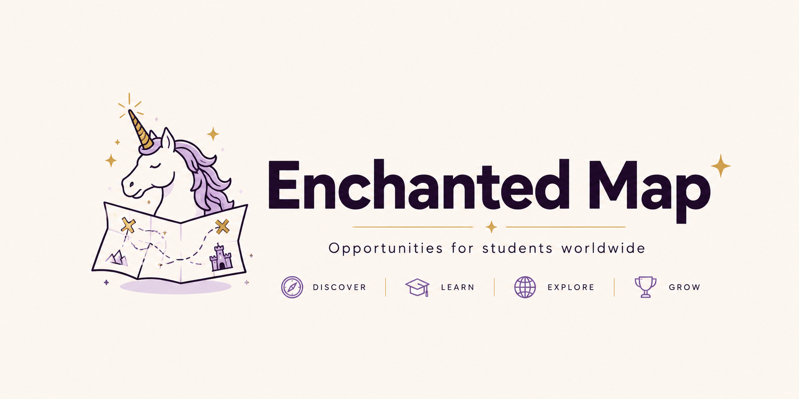
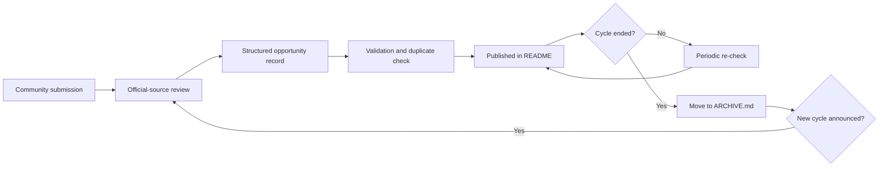

<!--
  WORKING TITLE: Enchanted Map
  Replace YOUR-USERNAME/YOUR-REPOSITORY in badge and issue URLs before publishing.
  Suggested repository slug: aventra-opportunities
-->

<div align="center">

# ✨ Enchanted Map

### Your Student Adventure Starts Here.

> Discover conferences, hackathons, fellowships, competitions, academies, exchange programs and other legendary opportunities around the world.

<br>

[](...)
[](...)
[](...)
[](...)

<br>



<br>

[](#-opportunity-board)
[](CONTRIBUTING.md)
[](...)

</div>

---

> [!IMPORTANT]
> **This is not another link dump.** Every listing must have a credible organizer, a real student pathway, an official source, and a meaningful outcome. No mysterious “global leadership summit” charging €1,200 for a certificate and a lanyard. Humanity has suffered enough.

<table>
<tr>
<td width="33%" valign="top">

### 🔭 Discover

Find worthwhile opportunities without searching through fifty newsletters, six university portals, and an Instagram poster designed during a caffeine emergency.

</td>
<td width="33%" valign="top">

### 🧭 Compare

See the deadline, location, format, eligibility, funding, and official application link in one place.

</td>
<td width="33%" valign="top">

### 🌍 Contribute

Found something valuable? Submit the official link in under two minutes. Maintainers verify it before publication.

</td>
</tr>
</table>

---

## ⚡ Start here

<table>
<tr>
<td align="center" width="33%">
<a href="#-conferences--summits"><h3>🎤 Conferences</h3></a>
Meet researchers, recruiters, founders, and people who somehow enjoy networking before coffee.
</td>
<td align="center" width="33%">
<a href="#-hackathons--build-challenges"><h3>🛠️ Hackathons</h3></a>
Build, test, pitch, and occasionally discover that your team has no backend developer.
</td>
<td align="center" width="33%">
<a href="#-competitions--challenges"><h3>🏆 Competitions</h3></a>
Engineering, research, business, design, science, writing, policy, and more.
</td>
</tr>
<tr>
<td align="center" width="33%">
<a href="#-academies-schools--courses"><h3>🎓 Academies</h3></a>
Selective schools, intensive courses, technical academies, and serious short programs.
</td>
<td align="center" width="33%">
<a href="#-fellowships"><h3>🚀 Fellowships</h3></a>
Mentorship, leadership, innovation, research, and professional development cohorts.
</td>
<td align="center" width="33%">
<a href="#-special-programs"><h3>🧩 Programs</h3></a>
Student programs that do not fit neatly elsewhere but are far too useful to ignore.
</td>
</tr>
</table>

<div align="center">

### One official link can open a door for thousands of students.

[](https://github.com/YOUR-USERNAME/YOUR-REPOSITORY/issues/new/choose)

</div>

---

## 🧭 Navigation

<table>
<tr>
<td valign="top" width="33%">

**Browse by type**

- [🎤 Conferences & Summits](#-conferences--summits)
- [🛠️ Hackathons & Build Challenges](#-hackathons--build-challenges)
- [🏆 Competitions & Challenges](#-competitions--challenges)
- [🎓 Academies, Schools & Courses](#-academies-schools--courses)
- [🚀 Fellowships](#-fellowships)
- [🧩 Special Programs](#-special-programs)

</td>
<td valign="top" width="33%">

**Browse by urgency**

- [🔥 Closing Soon](#-closing-soon)
- [✅ Open Now](#-opportunity-board)
- [⏳ Opening Soon](#-how-to-read-the-list)
- [🔁 Rolling Applications](#-how-to-read-the-list)
- [🗄️ Past Cycles](ARCHIVE.md)

</td>
<td valign="top" width="33%">

**Community**

- [➕ Add an Opportunity](https://github.com/YOUR-USERNAME/YOUR-REPOSITORY/issues/new/choose)
- [🛠️ Fix Outdated Information](https://github.com/YOUR-USERNAME/YOUR-REPOSITORY/issues/new/choose)
- [📖 Contribution Guide](CONTRIBUTING.md)
- [💛 Contributors](#-contributors)
- [📸 Opportunity Stories](#-from-the-community)

</td>
</tr>
</table>

---

## 🔥 Closing soon

<!-- CLOSING_SOON_START -->

> No verified opportunities are closing in the next 14 days yet. Either the calendar is being merciful, or the repository is new. [Add one here](https://github.com/YOUR-USERNAME/YOUR-REPOSITORY/issues/new/choose).

<!-- CLOSING_SOON_END -->

---

## 🧠 How to read the list

<table>
<tr>
<td valign="top" width="50%">

### Status

| Badge | Meaning |
|---|---|
| ✅ **OPEN** | Applications or registration are open now |
| 🔥 **CLOSING SOON** | The deadline is within roughly 14 days |
| ⏳ **OPENS SOON** | The next cycle is announced but not open yet |
| 🔁 **ROLLING** | Applications are reviewed continuously |
| ⚠️ **VERIFY** | Information needs a fresh official check |

</td>
<td valign="top" width="50%">

### Funding

| Tag | Meaning |
|---|---|
| **Fully funded** | Major participation costs are covered |
| **Partially funded** | Some costs are covered or reimbursed |
| **Free** | No participation or registration fee |
| **Scholarship** | Funding is available through an application |
| **Paid** | A participation fee or ticket is required |
| **Stipend** | Participants receive financial support |

</td>
</tr>
</table>

<details>
<summary><strong>What we verify before publishing</strong></summary>

<br>

Every listing should have:

- an official organizer or institution;
- a direct official source;
- a clear application or registration route;
- student, youth, or early-career eligibility;
- a defined cycle, date, or rolling process;
- a meaningful benefit such as learning, mentorship, networking, recognition, funding, research, or portfolio work.

Listings may be removed or archived when the information becomes outdated, the organizer disappears into the digital fog, or the opportunity no longer provides a credible student pathway.

</details>

<details>
<summary><strong>What does not belong here</strong></summary>

<br>

- Ordinary internships or job-board listings
- Full-degree scholarships
- Generic self-paced MOOCs
- Random one-hour webinars
- Tourism packages disguised as leadership programs
- Unverified personal projects recruiting free labour
- Events with no clear student access route
- Affiliate spam, referral farms, or scraped listings without an official source

</details>

---

# 🌐 Opportunity board

> [!WARNING]
> Deadlines, eligibility rules, locations, and funding can change. Always confirm the details on the official opportunity page before applying, booking travel, or informing your family that you are suddenly moving to Finland.

## 🎤 Conferences & Summits

Academic, industry, scientific, student, leadership, policy, and innovation events with a real student participation route.

<!-- CONFERENCES_START -->

| Status | Opportunity | Focus | When & Where | Format | Funding | Eligibility | Apply | Deadline |
|---|---|---|---|---|---|---|---|---|
| _No verified conferences yet_ | — | — | — | — | — | — | [Add one](https://github.com/YOUR-USERNAME/YOUR-REPOSITORY/issues/new/choose) | — |

<!-- CONFERENCES_END -->

<p align="right"><a href="#-start-here">↑ Back to categories</a></p>

---

## 🛠️ Hackathons & Build Challenges

Coding, AI, data, hardware, robotics, product, design, game, startup, and social-impact build events.

<!-- HACKATHONS_START -->

| Status | Opportunity | Focus | When & Where | Format | Funding | Eligibility | Apply | Deadline |
|---|---|---|---|---|---|---|---|---|
| _No verified hackathons yet_ | — | — | — | — | — | — | [Add one](https://github.com/YOUR-USERNAME/YOUR-REPOSITORY/issues/new/choose) | — |

<!-- HACKATHONS_END -->

<p align="right"><a href="#-start-here">↑ Back to categories</a></p>

---

## 🏆 Competitions & Challenges

Engineering, research, science, robotics, aerospace, business, entrepreneurship, design, writing, policy, and creative challenges.

<!-- COMPETITIONS_START -->

| Status | Opportunity | Focus | When & Where | Format | Funding / Prize | Eligibility | Apply | Deadline |
|---|---|---|---|---|---|---|---|---|
| _No verified competitions yet_ | — | — | — | — | — | — | [Add one](https://github.com/YOUR-USERNAME/YOUR-REPOSITORY/issues/new/choose) | — |

<!-- COMPETITIONS_END -->

<p align="right"><a href="#-start-here">↑ Back to categories</a></p>

---

## 🎓 Academies, Schools & Courses

Selective summer schools, winter schools, technical academies, intensive courses, research schools, and institution-backed learning programs.

<!-- ACADEMIES_START -->

| Status | Opportunity | Focus | When & Where | Format | Funding | Eligibility | Apply | Deadline |
|---|---|---|---|---|---|---|---|---|
| _No verified academies yet_ | — | — | — | — | — | — | [Add one](https://github.com/YOUR-USERNAME/YOUR-REPOSITORY/issues/new/choose) | — |

<!-- ACADEMIES_END -->

<p align="right"><a href="#-start-here">↑ Back to categories</a></p>

---

## 🚀 Fellowships

Structured mentorship, leadership, innovation, research, public-interest, and professional-development cohorts.

<!-- FELLOWSHIPS_START -->

| Status | Opportunity | Focus | When & Where | Format | Funding | Eligibility | Apply | Deadline |
|---|---|---|---|---|---|---|---|---|
| _No verified fellowships yet_ | — | — | — | — | — | — | [Add one](https://github.com/YOUR-USERNAME/YOUR-REPOSITORY/issues/new/choose) | — |

<!-- FELLOWSHIPS_END -->

<p align="right"><a href="#-start-here">↑ Back to categories</a></p>

---

## 🧩 Special Programs

Selective student programs, innovation cohorts, research experiences, ambassador programs, incubators, mentorship programs, and unusual opportunities that refuse to fit neatly into a dropdown menu.

<!-- PROGRAMS_START -->

| Status | Opportunity | Focus | When & Where | Format | Funding | Eligibility | Apply | Deadline |
|---|---|---|---|---|---|---|---|---|
| _No verified programs yet_ | — | — | — | — | — | — | [Add one](https://github.com/YOUR-USERNAME/YOUR-REPOSITORY/issues/new/choose) | — |

<!-- PROGRAMS_END -->

<p align="right"><a href="#-start-here">↑ Back to categories</a></p>

---

## 🧪 Is an opportunity worth adding?

Use this quick test before submitting:

<table>
<tr>
<td width="50%" valign="top">

### ✅ Usually a good fit

- Open to students, young people, or early-career applicants
- Run by a university, company, NGO, research institution, government body, or credible community
- Has a real deadline, cycle, or rolling application
- Offers funding, recognition, mentorship, learning, travel, networking, research, or portfolio value
- Has a direct official page

</td>
<td width="50%" valign="top">

### ❌ Usually not a fit

- Pure advertising event
- Generic course available forever
- No clear organizer
- No direct application path
- Extremely expensive with no student route
- Scraped from an aggregator with no official source
- “Exclusive global summit” whose main achievement is spelling exclusive correctly

</td>
</tr>
</table>

---

## ➕ Add an opportunity

Contributing should take about two minutes, not require a minor in Git archaeology.

```text
1. Open the submission form
2. Paste the official opportunity URL
3. Choose the opportunity type
4. Add the details you already know
5. A maintainer verifies and publishes it
```

<div align="center">

[](https://github.com/YOUR-USERNAME/YOUR-REPOSITORY/issues/new/choose)
[](CONTRIBUTING.md)

</div>

### Submission fields

The issue form should ask for:

- Opportunity name
- Official URL
- Type
- Organizer
- Focus areas
- Dates
- Location and participation format
- Application deadline
- Funding or prize information
- Eligibility
- Why it is valuable for students

> [!TIP]
> Missing some details? Submit the official link anyway. A maintainer can complete the record. The whole point is to lower the barrier, not recreate a government form.

---

## 🛡️ Accuracy and freshness

Every published opportunity should include a **last verified date** in the underlying dataset.

The maintenance cycle is:



> [!NOTE]
> The README should eventually be generated from structured data rather than maintained by hand. One source of truth, fewer contradictions, less ceremonial suffering.

---

## 🗂️ Repository structure

```text
.
├── README.md
├── ARCHIVE.md
├── CONTRIBUTING.md
├── CODE_OF_CONDUCT.md
├── LICENSE
├── data/
│   └── opportunities.json
├── assets/
│   ├── banner.png
│   ├── banner-dark.png
│   ├── logo.svg
│   ├── contributors/
│   └── community/
├── scripts/
│   ├── validate-opportunities.ts
│   ├── generate-readme.ts
│   └── archive-expired.ts
├── .github/
│   ├── ISSUE_TEMPLATE/
│   └── workflows/
└── web/
```

---

## 🧑‍🚀 Ways to contribute

<table>
<tr>
<td align="center" width="25%">

### 🔎 Scout
Find opportunities and submit official links.

</td>
<td align="center" width="25%">

### ✅ Verify
Check deadlines, eligibility, funding, and status.

</td>
<td align="center" width="25%">

### 💻 Build
Improve automation, validation, search, and the website.

</td>
<td align="center" width="25%">

### 🌍 Expand
Add overlooked regions, fields, languages, and communities.

</td>
</tr>
</table>

Good first contributions include:

- adding one verified opportunity;
- reporting a closed or outdated listing;
- improving an unclear description;
- checking official links;
- translating contribution guidance;
- helping build the data-to-README automation.

---

## 💛 Contributors

Built by students and contributors who believe useful opportunities should not remain hidden inside private group chats, forgotten newsletters, and one professor's inbox.

<!-- CONTRIBUTORS_START -->

<table>
<tr>
<td align="center">
<a href="https://github.com/YOUR-USERNAME">
<br>
<sub><strong>Project Maintainer</strong></sub>
</a>
</td>
<td align="center">
<a href="https://github.com/YOUR-USERNAME/YOUR-REPOSITORY/graphs/contributors">
<br>
<sub><strong>Your profile here</strong></sub>
</a>
</td>
</tr>
</table>

<!-- CONTRIBUTORS_END -->

[See every contributor →](https://github.com/YOUR-USERNAME/YOUR-REPOSITORY/graphs/contributors)

---

## 📸 From the community

Real photos, projects, teams, awards, and stories from opportunities discovered through this repository.

<div align="center">

<picture>
  <source media="(prefers-color-scheme: dark)" srcset="assets/community-title-dark.svg">
  
</picture>

</div>

<!-- COMMUNITY_GALLERY_START -->

> The gallery is waiting for its first story. Went somewhere, built something, presented research, survived a hackathon, or returned with a suspicious number of tote bags? Share it through the contribution form.

<!-- COMMUNITY_GALLERY_END -->

---

## 🧱 Planned improvements

- [ ] Structured opportunity dataset
- [ ] Automated README generation
- [ ] Duplicate detection
- [ ] Deadline and stale-entry checks
- [ ] Official-link validation
- [ ] Searchable web interface
- [ ] Filters for field, country, funding, format, and eligibility
- [ ] Personal saved-opportunity lists
- [ ] Weekly “closing soon” digest
- [ ] Community stories and gallery submissions

---

## 🤝 Acknowledgements

Inspired by community-maintained opportunity repositories such as BadgeUp and by every student who shared a useful application link instead of hoarding it like medieval treasure.

This project is independent and community-run. Opportunity names, logos, and trademarks belong to their respective organizers.

---

<div align="center">

### Find it. Apply. Build something worth remembering.

[](#-opportunity-board)
[](https://github.com/YOUR-USERNAME/YOUR-REPOSITORY/issues/new/choose)

<br><br>

<sub>Maintained with evidence, caffeine, and an entirely reasonable distrust of expired deadlines.</sub>

</div>
