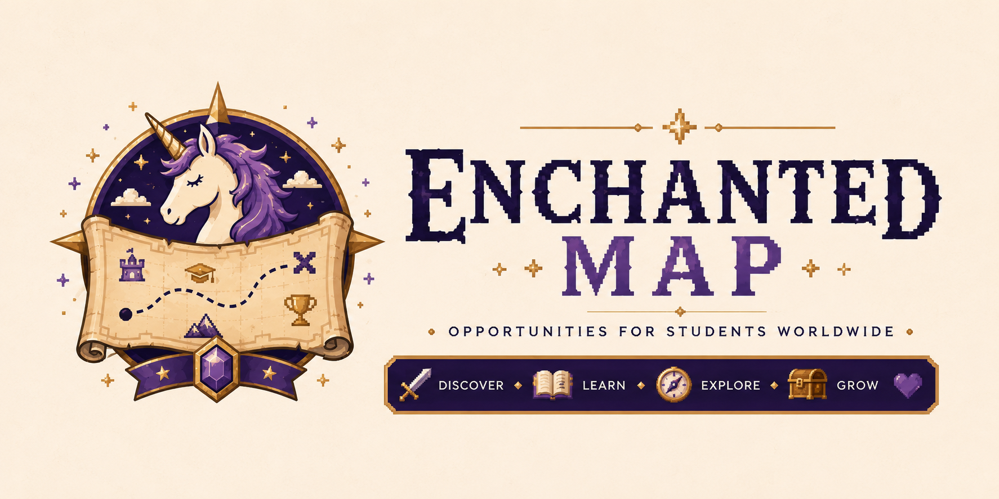

<div align="center">

[**README**](README.md) ·
[**CONTRIBUTING**](CONTRIBUTING.md) ·
[**EVENTS**](opportunities/events/) ·
[**INTERNSHIPS**](opportunities/internships/) ·
[**COMPETITIONS**](opportunities/competitions/) ·
[**RESEARCH**](opportunities/research/) ·
[**FELLOWSHIPS**](opportunities/fellowships/) ·
[**SCHOLARSHIPS**](opportunities/scholarships/) ·
[**COURSES & TRAINING**](opportunities/courses/) ·
[**INNOVATION**](opportunities/innovation/) ·
[**CREATIVE & OPEN CALLS**](opportunities/creative-calls/)

<!-- Add external Travel and Volunteering repository buttons here once those repositories are live. -->

# 🗺️ OffMap

### Built by students. Powered by the community.

> We’re creating the biggest student-powered opportunity map, **one discovery, one application, and one story at a time.**

<br>

[](https://github.com/elchrysaki/offmap-hub/stargazers)
[](https://github.com/elchrysaki/offmap-hub/graphs/contributors)
[](opportunities/README.md)
[](#closing-soon)

<br>


<br>

<a href="opportunities/README.md">

</a>

&nbsp;

<a href="CONTRIBUTING.md">

</a>

&nbsp;

<a href="https://github.com/elchrysaki/offmap-hub/issues/new?template=submit-opportunity.yml">

</a>

</div>

---

> [!NOTE]
> **Built by students for students.** OffMap brings worthwhile opportunities out of forgotten newsletters, private group chats, chaotic spreadsheets, and that one Instagram post you forgot to save. Whether you are looking for your first international experience or your next impossible-sounding challenge, this is your place to start.

**Find your path. Share what you discover. Help someone else begin theirs.**

<table>
<tr>
<td width="33%" valign="top">

### 🔎 Discover

Find worthwhile opportunities without searching through fifty newsletters, six university portals, and a clutter of Instagram posts.

</td>
<td width="33%" valign="top">

### ⚖️ Compare

See the deadline, location, format, eligibility, funding, and official application links in one place.

</td>
<td width="33%" valign="top">

### 🧭 Contribute

Found something valuable? Submit the official link in under two minutes. **Become a contributor.**

</td>
</tr>
</table>

---

## ⚡ Start here

> Find the opportunity that changes what you do next.

<table>
<tr>
<td align="center" width="33%">

<a href="opportunities/events/"><h3>🎤 Conferences & Events</h3></a>

Conferences, summits, forums, workshops, networking events, congresses, and cultural programs worth leaving your room for.

</td>
<td align="center" width="33%">

<a href="opportunities/internships/"><h3>🧰 Internships</h3></a>

Internships, traineeships, apprenticeships, and practical experience across different fields.

</td>
<td align="center" width="33%">

<a href="opportunities/competitions/"><h3>🏆 Hackathons & Competitions</h3></a>

Build, test, pitch. Hackathons, challenges, and competitions where ideas become actual projects.

</td>
</tr>

<tr>
<td align="center" width="33%">

<a href="opportunities/research/"><h3>🔬 Research</h3></a>

Research programs, placements, internships, and supervised opportunities to contribute to real projects.

</td>
<td align="center" width="33%">

<a href="opportunities/scholarships/"><h3>💰 Scholarships & Funding</h3></a>

Scholarships, grants, and travel grants that make worthwhile opportunities more accessible.

</td>
<td align="center" width="33%">

<a href="opportunities/fellowships/"><h3>🌱 Fellowships</h3></a>

Mentorship, leadership, professional development, and selective international cohorts.

</td>
</tr>

<tr>
<td align="center" width="33%">

<a href="opportunities/courses/"><h3>📚 Courses & Training</h3></a>

Academies, summer and winter schools, intensive courses, training programs, and bootcamps.

</td>
<td align="center" width="33%">

<a href="opportunities/innovation/"><h3>🚀 Innovation & Entrepreneurship</h3></a>

Startup programs, incubators, accelerators, entrepreneurship programs, and idea-building opportunities.

</td>
<td align="center" width="33%">

<a href="opportunities/creative-calls/"><h3>🎨 Creative & Open Calls</h3></a>

Writing, media, design, art, publishing, exhibitions, and open calls for creative work.

</td>
</tr>
</table>

<div align="center">

### One link can open a door for thousands of students.

[](https://github.com/elchrysaki/offmap-hub/issues/new?template=submit-opportunity.yml)

</div>

---

## Navigation

<table>
<tr>
<td valign="top" width="25%">

### Browse by type

- [🎤 Events](opportunities/events/)
- [🧰 Internships](opportunities/internships/)
- [🏆 Competitions](opportunities/competitions/)
- [🔬 Research](opportunities/research/)
- [🌱 Fellowships](opportunities/fellowships/)
- [💰 Scholarships](opportunities/scholarships/)
- [📚 Courses & Training](opportunities/courses/)
- [🚀 Innovation & Entrepreneurship](opportunities/innovation/)
- [🎨 Creative & Open Calls](opportunities/creative-calls/)

</td>
<td valign="top" width="25%">

### Browse by field

- ⚙️ Engineering & Technology
- 💻 Computing, AI & Data
- 🧪 Natural Sciences
- 🧬 Health & Life Sciences
- 📈 Business & Economics
- ⚖️ Society, Policy & Law
- 🌱 Environment & Sustainability
- 🎨 Arts, Media & Design
- 📚 Humanities & Education
- 🧩 Multidisciplinary

<sub>Field-specific links will be added when the generated filter pages are ready.</sub>

</td>
<td valign="top" width="25%">

### Browse by urgency

- [🔥 Closing Soon](#closing-soon)
- [✅ All Published Opportunities](opportunities/README.md)
- ⏳ Opening Soon
- 🔄 Rolling Applications
- 📅 Upcoming Cycles
- 🗃️ Past Opportunities

<sub>Additional urgency pages will be linked once they exist.</sub>

</td>
<td valign="top" width="25%">

### Community

- [➕ Add a Discovery](https://github.com/elchrysaki/offmap-hub/issues/new?template=submit-opportunity.yml)
- [🛠️ Fix Outdated Information](https://github.com/elchrysaki/offmap-hub/issues/new/choose)
- [📖 Read the Contribution Guide](CONTRIBUTING.md)
- [👥 Meet the Contributors](#contributors)
- [📸 Share an Opportunity Story](#from-the-community)
- [💬 Join the Discussion](https://github.com/elchrysaki/offmap-hub/discussions)

</td>
</tr>
</table>

---

## How to read the list

<table>
<tr>
<td valign="top" width="50%">

### Status

| Badge | Meaning |
|---|---|
| ✅ **OPEN** | Applications or registration are open now |
| 🔥 **CLOSING SOON** | The confirmed deadline is approaching |
| ⏳ **OPENS SOON** | The next cycle is announced but not open yet |
| 🔄 **ROLLING** | Applications are reviewed continuously |
| ⚠️ **VERIFY** | Information needs a fresh official check |

</td>
<td valign="top" width="50%">

### Funding

| Tag | Meaning |
|---|---|
| **Fully funded** | Major participation costs are covered |
| **Partially funded** | Some costs are covered or reimbursed |
| **Free** | No participation or registration fee |
| **Scholarship** | Funding is available through an application |
| **Paid** | A participation fee or ticket is required |
| **Stipend** | Participants receive financial support |

</td>
</tr>
</table>

<details>
<summary><strong>What we verify before publishing</strong></summary>
<br>

Every listing should have:

- an official organizer or institution;
- a direct official source;
- a clear application or registration route;
- student, youth, or early-career eligibility;
- a defined cycle, date, or rolling process;
- a meaningful benefit such as learning, mentorship, networking, recognition, funding, research, or portfolio work.

Listings may be removed or archived when the information becomes outdated, the organizer disappears into the digital fog, or the opportunity no longer provides a credible student pathway.

</details>

<details>
<summary><strong>What does not belong here</strong></summary>
<br>

- Ordinary job-board listings
- Full-degree scholarships
- Generic self-paced MOOCs
- Random one-hour webinars
- Tourism packages disguised as leadership programs
- Unverified personal projects recruiting free labour
- Events with no clear student access route
- Affiliate spam, referral farms, or scraped listings without an official source

</details>

---

## 🔥 Closing soon

> [!TIP]
> **Deadlines do not wait for motivation to arrive.**
>
> This section shows up to **six published opportunities with the nearest confirmed deadlines**. Distinct main categories are prioritised first, then any remaining spaces are filled by deadline order. If fewer than six qualifying opportunities are published, fewer will appear. No imaginary listings are added merely to make the table look emotionally complete.

<!-- CLOSING_SOON_START -->

| Status | Category | Opportunity | Focus | When & Where | Format | Funding / Prize | Eligibility | Apply | Deadline |
|---|---|---|---|---|---|---|---|---|---|
| 🔥 Closing soon | Challenge | [EUROAVIA Ideathon 2026](opportunities/competitions/euroavia-ideathon-2026.md) | Aerospace engineering, innovation and teamwork | 3–8 Nov 2026 · Brugge, Belgium | In person | Participation fee; accommodation packages available | Bachelor’s and master’s students, 18+, teams of 3–5 | [Apply](https://ideathon.euroavia.eu/applications) | **27 Jul 2026** |

<!-- CLOSING_SOON_END -->

<p align="right"><a href="#navigation">↑ Back to navigation</a></p>

---

## ➕ Add an opportunity

Found a conference, competition, scholarship, hackathon, course, or another opportunity worth sharing?

Adding it takes around **two minutes**.

```text
1. Click “Add an Opportunity”
2. Paste the official opportunity link
3. Select the opportunity type
4. Add any details you already know
5. Submit the form
```

A maintainer will review the information, verify it using official sources, and prepare the final opportunity page for publication.

> [!IMPORTANT]
> You do not need to know every detail. Even an official link and a few basic facts can help someone discover their next opportunity.

<div align="center">

[](https://github.com/elchrysaki/offmap-hub/issues/new?template=submit-opportunity.yml)
[](CONTRIBUTING.md)

</div>

---

## Contributors

OffMap is built by students, volunteers, and curious people who believe valuable opportunities should be easier to find and easier to share.

<!-- CONTRIBUTORS_START -->

<table>
<tr>
<td align="center">
<a href="https://github.com/elchrysaki">
<br>
<sub><strong>Elena Chrysaki</strong></sub><br>
<sub>Project Maintainer</sub>
</a>
</td>
<td align="center">
<a href="https://github.com/elchrysaki/offmap-hub/issues/new?template=submit-opportunity.yml">
<br>
<sub><strong>Your profile could be here</strong></sub><br>
<sub>Join the community</sub>
</a>
</td>
</tr>
</table>

<!-- CONTRIBUTORS_END -->

Want to help build the map?

[Submit an opportunity →](https://github.com/elchrysaki/offmap-hub/issues/new?template=submit-opportunity.yml)

[See every contributor →](https://github.com/elchrysaki/offmap-hub/graphs/contributors)

---

## From the community

OffMap is also a place to see what students actually **built, presented, explored, competed in, and experienced** after finding an opportunity.

Share photographs, projects, team moments, awards, lessons, and short stories from events you attended. Selected recent community stories may be featured here.

<!-- COMMUNITY_GALLERY_START -->

> **The community gallery is waiting for its first story.**
>
> Attended a conference, survived a hackathon, presented research, joined a competition, or returned home with an unreasonable number of tote bags? Share your experience through GitHub Discussions.

<!-- COMMUNITY_GALLERY_END -->

<div align="center">

[](https://github.com/elchrysaki/offmap-hub/discussions/new?category=show-and-tell)
[](https://github.com/elchrysaki/offmap-hub/discussions/categories/show-and-tell)

</div>

> **Photo permission:** Only upload photographs you own or have permission to share. Make sure everyone clearly visible has agreed to appear publicly.

---

## Acknowledgements

OffMap is, at heart, a **community-built project**, so it could not exist without the people who contribute, correct, review, and share. It takes inspiration from projects such as BadgeUp and from every student who chose to pass an opportunity on instead of keeping it hidden.

We believe the right opportunity should not depend on who you know, which group chat you are in, or whether the right link reaches you in time.

#### Thank you to everyone who helps build the map.

> OffMap is an independent, community-run project and is not affiliated with the organisations featured unless explicitly stated. All names, logos, and trademarks belong to their respective owners.

---

<div align="center">

### Find it. Apply. Build something worth remembering.

[](opportunities/README.md)
[](https://github.com/elchrysaki/offmap-hub/issues/new?template=submit-opportunity.yml)

<br><br>

[Contribution Guide](CONTRIBUTING.md) ·
[License](LICENSE) ·
[Security](SECURITY.md) ·
[Issues](https://github.com/elchrysaki/offmap-hub/issues) ·
[Discussions](https://github.com/elchrysaki/offmap-hub/discussions)

<br><br>

<sub>Maintained with evidence, caffeine, and an entirely reasonable distrust of expired deadlines.</sub>

</div>
